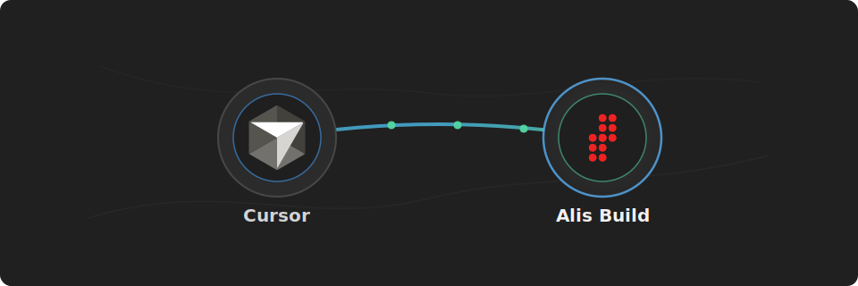

# Alis Build Cursor Plugin

<p align="center">
  
</p>

<p align="center">
  <strong>Connect Cursor to Alis Build.</strong>
</p>

Use this plugin to let Cursor inspect Alis Build landing zones, products, neurons, builds, deploys, and related workspace context.

## What You Get

- A preconfigured Cursor MCP server for `https://mcp.alis.build`
- A preconfigured static Alis Build OAuth client and scopes for MCP sign-in
- OAuth/OIDC sign-in through `https://identity.alisx.com`
- Alis Build tools available inside Cursor after sign-in

## Before You Start

You need:

- Cursor with plugin support
- An Alis Build account with access to the landing zones and products you want to use
- Network access to `https://mcp.alis.build` and `https://identity.alisx.com`
- The Alis Build OAuth client must allow Cursor's MCP redirect URI: `cursor://anysphere.cursor-mcp/oauth/callback`

## Install

Install this repository as a Cursor plugin marketplace, then install the `tools` plugin from that marketplace.

## Use It

After sign-in, ask Cursor to use Alis Build:

```text
build it
```

```text
fix it
```

```text
Use Alis Build to list the landing zones I can access.
```

```text
Use Alis Build to inspect the current workspace, product, active neurons, and recent build status.
```

```text
Use Alis Build to review the latest failed build or deploy logs and suggest the next action.
```

## Workflow Prompts

This plugin includes Cursor rules for Alis Build workflow prompts:

```text
build it
fix it
Use the getting-started skill to help me get started on Alis Build.
```

`build it` discovers the right Alis Build skill for the thing you want to build. `fix it` is an alias for the same discovery flow when the goal is framed as a fix.

## Validate

```sh
node scripts/validate-template.mjs
```

## Troubleshooting

If `alis-build` does not appear as an MCP server, confirm the plugin install completed and that `plugins/tools/mcp.json` is present in this plugin.

If sign-in fails with `Incompatible auth server: does not support dynamic client registration`, confirm the installed plugin's MCP config contains `auth.CLIENT_ID`. Cursor uses that static OAuth client for Alis Build because the auth server does not support Dynamic Client Registration.

If sign-in fails with `invalid redirect`, confirm the Alis Build OAuth client allows the exact redirect URI `cursor://anysphere.cursor-mcp/oauth/callback`.

If sign-in still fails, confirm that you can reach both `https://mcp.alis.build` and `https://identity.alisx.com`, then retry the MCP login flow in Cursor.
