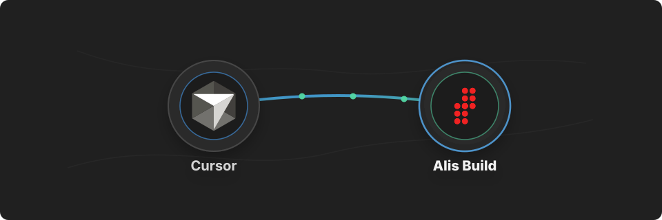

# Alis Build Cursor Plugin

<p align="center">
  
</p>

<p align="center">
  <strong>Connect Cursor to Alis Build.</strong>
</p>

Use this plugin to let Cursor work with Alis Build organisations, products, neurons, builds, and deploys through the `alis` CLI, with workspace-aware context injected into every session.

## What You Get

- A standing Define → Build → Deploy primer rule with CLI-first skill routing (`alis skills search|load`)
- Auto-approval of clean `alis …` CLI commands via a `beforeShellExecution` hook, with `--confirm-production` / `--approve` / `blocks uninstall --yes` always prompting (double-keyed)

## Before You Start

You need:

- Cursor with plugin support
- The `alis` CLI installed, on your `PATH`, and signed in (`alis login`)
- An Alis Build account with access to the organisations and products you want to use

## Install

Install this repository as a Cursor plugin marketplace, then install the `tools` plugin from that marketplace.

## Use It

After installing, ask Cursor to use Alis Build:

```text
build it
```

```text
fix it
```

```text
Use Alis Build to list the organisations I can access.
```

```text
Use Alis Build to inspect the current workspace, product, active neurons, and recent build status.
```

```text
Use Alis Build to review the latest failed build or deploy logs and suggest the next action.
```

## Workflow Prompts

This plugin includes Cursor rules for Alis Build workflow prompts:

```text
build it
fix it
Use the getting-started skill to help me get started on Alis Build.
```

`build it` discovers the right Alis Build skill for the thing you want to build (via `alis skills search`). `fix it` is an alias for the same discovery flow when the goal is framed as a fix.

## Validate

```sh
node scripts/validate-template.mjs
```

## Troubleshooting

If the rules or hooks do not take effect, confirm the plugin install completed and reload Cursor.

If `alis` commands fail with an auth error, run `alis login` (or `alis authorise <org>.<product>` for git/package credentials) and retry.
